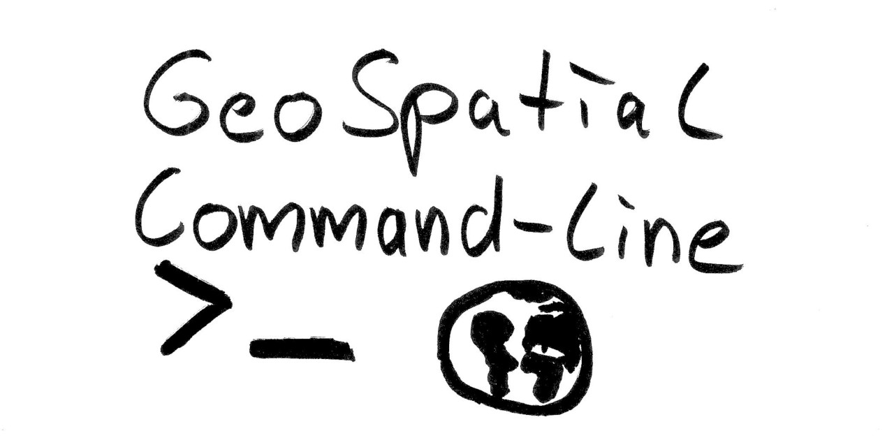

# Geospatial Commandline Tools

A collection of geospatial programs with commandline interface. The starting point of the list was this [tweet](https://twitter.com/JakobMiksch/status/1358012117924904960) which contains many useful responses.

## Generic Vector & Raster

- [GDAL/OGR](https://gdal.org/) - Powerful tools for conversion and processing of most geospatial formats.
- [QGIS/qgis_process](https://docs.qgis.org/3.16/en/docs/user_manual/processing/standalone.html) - Interface for accessing QGIS processing tools.
- [GRASS](https://grass.osgeo.org/grass78/manuals/grass7.html) - Execute GRASS algorithms.
- [SAGA GIS](http://www.saga-gis.org/en/index.html) - Execute SAGA GIS algorithms.
- [Whitebox Tools](https://github.com/jblindsay/whitebox-tools) - Execute geospatial algorithms.

## Vector

- [Fiona](https://github.com/Toblerity/Fiona/blob/master/docs/cli.rst) - Process vector data.
- [shp2pgsql / pgsql2shp / shpdump](https://manpages.ubuntu.com/manpages/bionic/man1/shpdump.1.html) Shapefile related tools.
- [spatialite](https://www.gaia-gis.it/fossil/spatialite-tools/index) - A SQLite bases database for spatial data.
- [topojson](https://github.com/topojson/topojson) - Handling the TopoJSON format.
- [geojsonhint](https://github.com/mapbox/geojsonhint) - Validate GeoJSON files.
- [csv2geojson](https://github.com/mapbox/csv2geojson) - Convert CSV to GeoJSON.
- [d3-geo](https://github.com/d3/d3-geo) - Geographic projections, spherical shapes and spherical trigonometry.
- [d3-geo-projection](https://github.com/d3/d3-geo-projection) - Extended geographic projections for d3-geo.
- [geojson-merge](https://github.com/mapbox/geojson-merge) - Merge multiple GeoJSON files.
- [Mapshaper](https://github.com/mbloch/mapshaper) - Convert between Shapefile, GeoJSON, TopoJSON and CSV.
- [geojsonio](https://github.com/mapbox/geojsonio-cli) - Display GeoJSON files in the browser.
- [wellknown](https://github.com/mapbox/wellknown) - Handle WKT (well known text) geometries.

## Raster & Remote Sensing

- [Rasterio](https://rasterio.readthedocs.io/en/latest/cli.html) - Process raster data.
- [libtiff](http://www.libtiff.org/man/tiffsplit.1.html) - TIFF Library and Utilities.
- [Orfeo ToolBox](https://www.orfeo-toolbox.org/) A toolbox for remote sensing.
- [OpenDroneMap](https://github.com/OpenDroneMap/ODM) - Process drone imagery.
- [TauDEM](https://hydrology.usu.edu/taudem/taudem5/index.html) - a suite of Digital Elevation Model (DEM) tools.
- [felicette](https://github.com/plant99/felicette) - Download satellite images.
- [eodag](https://github.com/CS-SI/eodag) - Earth Observation Data Access Gateway.
- [micmac](https://micmac.ensg.eu/index.php/MicMac_tools) - Photogrammetric suite.
- [sat-search](https://github.com/sat-utils/sat-search) - Access SpatioTemporal Asset Catalog (STAC) API.
- [PkTools](http://pktools.nongnu.org/html/index.html) - Utilities for image processing.
- [go-spatial](https://github.com/jblindsay/go-spatial) - Manipulation of geospatial data.
- [stactools](https://github.com/stac-utils/stactools) - Command line utility and Python library for STAC.
- [gdal-exprtk](https://github.com/mmomtchev/gdal-exprtk) - GDAL-based raster calculation with JavaScript and ExprTk expresssions.
- [cogger](https://github.com/airbusgeo/cogger) - GeoTIFF to COG converter.

## Rendering and Styling

- [GMT](https://www.generic-mapping-tools.org/) - Display geospatial data.
- [mapnik](https://mapnik.org/) - Mapping Toolkit.
- [GeoStyler](https://geostyler.org/) - Conversion from and to various geospatial style formats.
- [carto](https://cartocss.readthedocs.io/en/latest/installation_usage.html) - Edit CartCSS styles.
- [t-Rex](https://t-rex.tileserver.ch) - Creation and Serving of vector tiles.
- [tippecanoe](https://github.com/mapbox/tippecanoe) - Build vector tiles.
- [mbgl-renderer](https://github.com/consbio/mbgl-renderer) - Static Renderer for MapboxGL.
- [BareMaps](https://github.com/baremaps/baremaps) - Creation of custom vector tiles.
- [Mapproxy](https://mapproxy.org/) - Proxy for geospatial data.
- [pygeoapi](https://pygeoapi.io/) - A Python server implementation of the OGC API suite of standards.
- [pg_tileserv](https://github.com/CrunchyData/pg_tileserv) - A PostGIS-only tile server in Go.
- [pg_featureserv](https://github.com/CrunchyData/pg_featureserv) - Geospatial Feature Server for PostGIS in Go.

## OpenStreetMap

- [osmium](https://osmcode.org/osmium-tool/) - Powertool for any type of OpenStreetMap data processing.
. [pyosmium](https://docs.osmcode.org/pyosmium/latest/tools.html) - Utilities for updating OSM files.
- [osm2pgsql](https://osm2pgsql.org/) - Load OpenStreetMap data in a PostgreSQL/PostGIS Database. Written in C++.
- [osmprj](https://github.com/travishathaway/osmprj) - Import OSM data to Postgres and create reports.
- [osmtogeojson](https://github.com/tyrasd/osmtogeojson) - Convert OpenStreetMap XML to GeoJSON.
- [Imposm](https://imposm.org/) - Load OpenStreetMap data in a PostgreSQL/PostGIS Database. Written in Go.
- [osmctools](https://gitlab.com/osm-c-tools/osmctools) - Convert, filter and update OpenStreetMap data files.
- [osm-tags-transform](https://github.com/osmcode/osm-tags-transform) - Transform tags in OSM files using Lua code.
- [mapsplit](https://github.com/simonpoole/mapsplit) - Split OSM data in to a portable tiled format.

## Point Cloud

- [PDAL](https://pdal.io/) - Point Data Abstraction Library.
- [CloudCompare](https://www.cloudcompare.org/doc/wiki/index.php?title=Command_line_mode) - Tools for processing point clouds.
- [OPALS](https://opals.geo.tuwien.ac.at/html/stable/usr_getting_started.html) - Processing of airborn laser scanning.
- [LAStools](https://rapidlasso.com/lastools/) - Tools for processing point clouds.

## Other

- [PROJ](https://proj.org/index.html) - Converts coordinate reference systems.
- [pyproj](https://pyproj4.github.io/pyproj/stable/cli.html) - Python interface to PROJ.
- [GEOS](https://git.osgeo.org/gitea/geos/geos/src/branch/master/util/geosop/README.md) - Performs geometric operations.
- [pygeometa](https://geopython.github.io/pygeometa/) - Create geospatial metadata.
- [MDAL](https://www.mdal.xyz/) - Mesh Data Abstraction Library.
- [valhalla](https://github.com/valhalla/valhalla) - Routing Engine.
- [PCRaster](https://pcraster.geo.uu.nl/) - Software for environmental modelling.
- [Cesium Terrain Builder](https://github.com/geo-data/cesium-terrain-builder) - Create terrain tiles for use in the Cesium JavaScript library.
- [geodiff](https://github.com/lutraconsulting/geodiff) - Handle differences in geospatial data.
- [GeoGig](http://geogig.org/) - Geospatial version control.
- [Kart](https://kartproject.org) - Geospatial version control.
- [mergin](https://github.com/lutraconsulting/mergin-py-client) - Python client module for access to [Mergin](https://public.cloudmergin.com) and a command-line tool for access to data stored in Mergin.

## Links

- [Command-Line Cartography](https://medium.com/@mbostock/command-line-cartography-part-1-897aa8f8ca2c#06f4) - Blog Post Series of Mike Bostock.
- [Vector Tiles](https://github.com/mapbox/awesome-vector-tiles#cli-utilities) - Section about vector tile related CLI tools.
- [Fiona/Rasterio Cheatsheet](https://github.com/sgillies/frs-cheat-sheet)
- [Talk: Are be going back to Command Line GIS](https://media.ccc.de/v/bucharest-212-are-we-going-back-to-command-line-gis-)
- [Slides: Command-Line Geography](https://nerik.github.io/cli-geography)
